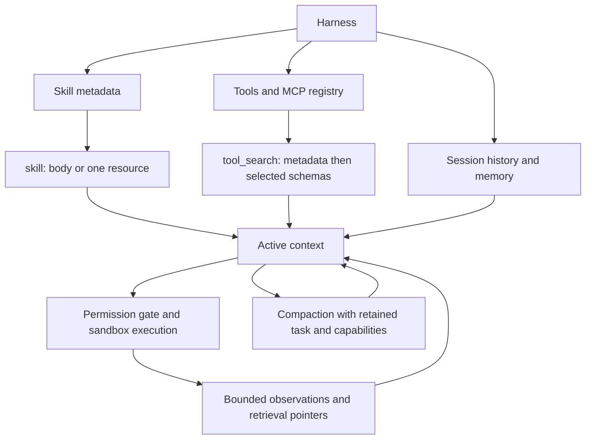

# Capability loading and artifact workflows

Kalash searches the workspace and reads selected evidence. The filesystem holds
source files and artifacts; SQLite holds session history and scoped memory;
active model context holds selected instructions, observations and conversation.

## Three loading levels

These are context loading levels, separate from how long data persists:

| Level | Contents | When loaded |
| --- | --- | --- |
| Always loaded | System contract, mode, root guidance, core schemas | Every request |
| Available metadata | Skill names/descriptions; extension metadata in the registry | Skill catalog at startup; extensions through `tool_search` |
| Task loaded | Skill body, one resource, selected extension schemas and artifact units | Explicit tool call |



`search`, `glob`, `list` and ranged `read` handle repository discovery. Bulky
observations can be retrieved selectively with `expand`. Compaction preserves
user constraints, closed tool exchanges, loaded skill bodies and working notes.

Skill precedence is **project > user > plugin > bundled**. Discovery reads only
frontmatter. `skill(name="pdf")` loads a body and lists resource paths without
reading their contents. Load one resource with:

```json
{"name":"pdf","resource":"references/workflow.md","offset":0,"limit":8000}
```

Resource reads are capped at 20k characters. Traversal and symlinks outside the
skill are rejected. Scripts never execute on load; execution uses the normal
shell tool. The bulk `references=true` option remains for compatibility.

## Workflow support

Skills provide instructions and recipes; existing tools and installed libraries
perform effects. A skill is not an execution engine.

| Capability | Execution path | Conditions and limits |
| --- | --- | --- |
| Filesystem | Read/list/glob/search/write/edit, shell moves | Existing permission/path gates |
| Shell/execution | Shell and background handles | Existing sandbox and timeout |
| Code | File tools and shell tests/builds | Repository-specific verification |
| Git | Shell and Git workflow skill | Operations require task authorization |
| Web | web_search/fetch/configured MCP | Network/provider setup required |
| PDF | Selected-page text, pypdf/reportlab recipes | Optional parsers; OCR/rendering separately installed |
| Documents | DOCX paragraphs/table text, python-docx editing, plain text tools | DOCX text uses stdlib; RTF conversion needs LibreOffice |
| Spreadsheets | XLSX sheet catalog/selected rows, openpyxl/csv recipes | Formula source preserved; recalculation needs an engine; XLS needs conversion |
| Presentations | PPTX slide text, python-pptx recipes | Rendering needs LibreOffice/Poppler; PPT needs conversion |
| Images | Pillow metadata and transformation recipes | Pixel interpretation needs a connected vision tool; no bundled generation service |
| Archives | ZIP/TAR member listing and safe-operation guidance | Inspector never extracts; compressed scanning bounded |
| Data | Selected JSON entries, CSV/TSV/JSONL rows, streaming recipes | Explicit types/encoding; bounded output |

Install parsers with `uv sync --extra artifacts` in a checkout or
`python -m pip install 'kalash-code[artifacts]'` in an installed environment.
Parsers import only for the requested format. Skill loading never installs them.

Use the Python environment containing Kalash, through the shell tool:

```bash
python -m kalash.artifacts report.pdf --offset 1 --limit 2 --max-chars 8000
python -m kalash.artifacts report.xlsx --limit 5
python -m kalash.artifacts report.xlsx --sheet Summary --offset 0 --limit 10
```

Offsets select zero-based pages, paragraphs, slides, rows or archive members.
Outputs include path, SHA-256, labels, continuation offset and truncation flags.
Limits: 32 MiB input, 100 selected units, 4k text per unit, 32k selected text,
100 spreadsheet columns. The JSON envelope adds bounded overhead. A truncated
unit needs a targeted script; next_offset advances to the next unit.
Text extraction and image metadata do not establish visual quality.

Office archives reject excessive member count/size/compression ratio and XML
entities/DTDs. TAR listing bounds decompressed scanning. These guards do not
establish memory/CPU isolation for hostile parser inputs: use disposable,
resource-limited execution for hostile files.

## Extension discovery and continuity

`tool_search()` browses up to five permitted metadata entries with pagination.
A literal-word query or exact names activates up to five extension tools:

```json
{"query":"search API documentation"}
```

Full schemas enter the next request's tools field rather than appearing twice
in context. Search makes no model/API call and executes no selected tool.
Capability, plan-mode and network restrictions filter discovery and schemas;
execution still uses the ordinary gate. Child allowlists remain authoritative.

Core schemas are immediately available. Extensions append in activation order
and survive compaction. Resume restores availability from successful searches
and previous calls without replaying effects. Successful recorded skill bodies
are retained for subsequent compaction as well.

Adding schemas can invalidate prefix caches at discovery; unchanged requests
remain stable. There is no eviction policy: activating all tools eventually
loads all schemas. MCP connections still initialize during prepare; this is lazy
schema disclosure, not lazy transport startup. MCP remains a trusted host extension.
TURN_START events expose tool_schema_count and tool_schema_tokens_estimate;
token counts remain character estimates.

## Evidence and competitive direction

The synthetic 100-extension fixture estimates **32,613** eager schema tokens,
**3,872** core-only tokens and **4,160** with one extension: **87.2% less schema
context** for that fixture. This is not whole-request cost, latency or task quality.

DeepSeek's [official architecture](https://github.com/deepseek-ai/deepseek-harness/blob/master/docs/architecture.md)
describes Cordis plugins, replaceable capabilities and durable session-event
projections. Kalash keeps a smaller Python core with explicit ownership.
Auditable artifact evidence, provider-independent discovery and visible context
costs are useful differentiators to develop, not claims of industry exclusivity.
Anthropic's [tool search documentation](https://platform.claude.com/docs/en/agents-and-tools/tool-use/tool-search-tool)
also supports client-side on-demand discovery; Kalash implements that approach.

Benchmarking remains paused. Crash/security hardening, full configured lint and
semantic compaction checks remain in NEXT_SESSION.md. A competitive comparison
needs pinned revisions and identical models, tasks, environments and official
graders. This implementation does not establish that Kalash beats DeepSeek.
