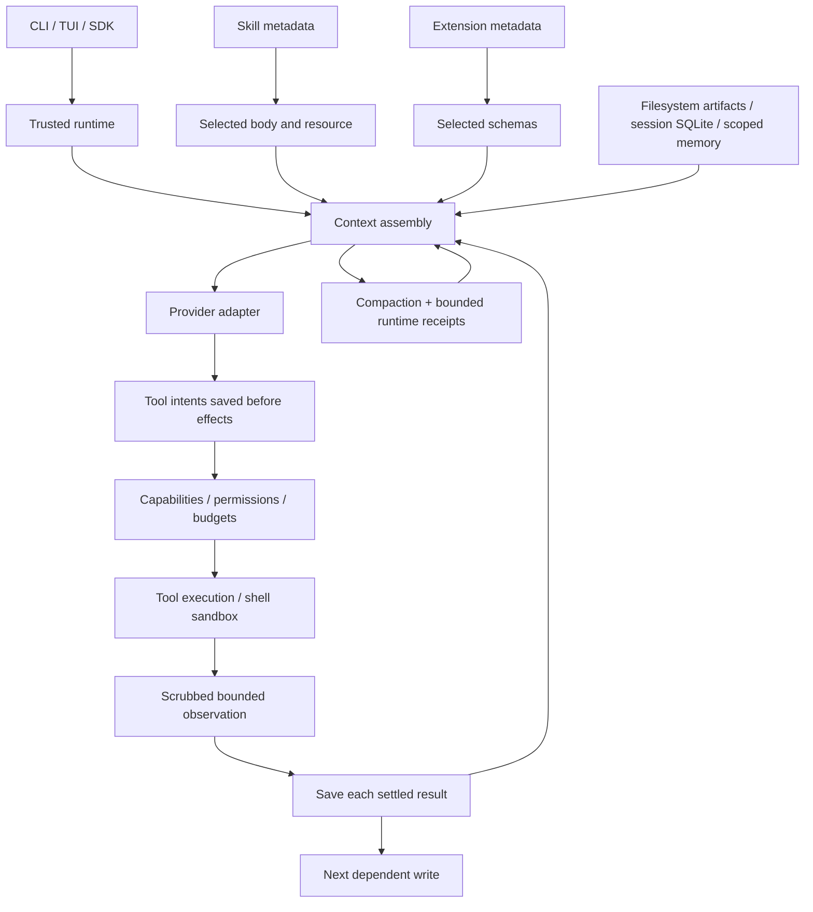

# Kalash harness design and acceptance gates

Kalash should maximize independently verified work per dollar and per minute,
while retaining reliable recovery and explicit control over effects. Universal
market superiority is not a testable product requirement. The testable requirement
is better results on published, reproducible comparisons with disclosed limits.

This document distinguishes implemented mechanisms from proposed work. Live
benchmarking remains paused until the readiness gates pass. No comparative
quality result is available.

## Architecture decision

Keep one small trusted runtime responsible for permissions, budgets, scheduling,
observation limits and persistence. Providers, tools and task recipes have narrow
interfaces. A recipe can explain how to work; it cannot grant authority. A tool
schema advertises an operation; execution still requires the runtime gate.

DeepSeek's published architecture makes the loop, tools and persistence
replaceable plugins in a Cordis composition. Kalash deliberately keeps these
control boundaries in a small core. This is a design choice to investigate,
not evidence that either architecture is faster or more capable.
[DeepSeek architecture](https://github.com/deepseek-ai/deepseek-harness/blob/master/docs/architecture.md).

Trusted hooks and MCP currently run with host authority. They are not isolated
by the shell sandbox. A hostile-workload profile must disable them until isolated
workers and narrowly scoped credentials are implemented and tested.

## Loading is different from persistence

The three requested levels describe prompt loading, not three durable stores.

| Prompt level | Contents | Current implementation |
| --- | --- | --- |
| Always loaded | Runtime contract, mode, root guidance, core tool schemas | Stable instruction prefix and API tools field |
| Available metadata | Skill catalog; permitted extension names/descriptions | Skill discovery and `tool_search`; no automatic body loading |
| Task loaded | Selected skill/resource, extension schema, file/artifact ranges | Bounded explicit reads; successful activations restored without effects |

Actual persistence is separate: source/artifact files, SQLite transcripts and
scoped memory, scratchpad observations, and an ephemeral model request. Loaded
instructions are selected context. They do not become higher-priority authority
because they survive a summary.

All 12 requested workflow categories have bundled skills. Their execution paths,
optional dependencies and format limits are recorded in
[CAPABILITIES.md](CAPABILITIES.md). Visual artifact verification, OCR and image
generation still require integrations; listing those skills does not supply those
engines.

## Implemented recovery boundaries

The assistant message containing tool intents is saved before tool execution.
Each settled tool result is then saved separately before another dependent write
can start. Concurrent reads settle independently; if a receipt fails, sibling
reads are cancelled and joined. A receipt failure is a runtime failure, not a
successful effect disguised as a tool error.

| Crash boundary | Recovery interpretation | Evidence |
| --- | --- | --- |
| After intent, before effect | No durable result; inspect before retrying | Abrupt-exit subprocess test |
| After effect, before receipt | Outcome unknown; the workspace may have changed | Abrupt-exit subprocess test |
| After first receipt, before next effect | Preserve first observed result; second outcome unknown | Abrupt-exit subprocess test |
| Receipt storage fails | Stop subsequent dependent writes | Executor failure test |
| Concurrent read receipt fails | Cancel and join remaining reads | Executor failure test |

Resume repairs tool-call/result pairs and never executes recorded calls itself.
The model may propose a new retry, which is a new gated action. There is no
exactly-once external-effect guarantee, filesystem rewind or durable event reducer.
The in-process event bus remains notification infrastructure, not the recovery log.

SQLite operations now own their connections. SQLite orders sync and async
writers; cancellation inside a managed transaction rolls it back. Waiting async
writers acquire the transaction off the event loop, and cancelled waits close the
eventual connection without executing user SQL. Migrations commit schema changes
and their receipt together and recheck receipt existence under the writer lock.
Separate connections provide the isolation a shared connection does not provide.
[SQLite isolation](https://www.sqlite.org/isolation.html).

Tradeoff: opening a connection per operation adds setup cost. Optimize with an
owned pool or dedicated writer only if measurements justify it; never restore
shared transaction ownership to save a few allocations. Synchronous callers and
transaction bodies can still block their calling thread. Durability uses WAL and
`synchronous=NORMAL`; abrupt process death tests do not prove power-loss durability.

## Implemented observation and context boundaries

Ordinary observation text is scrubbed before host deferral and rendering;
scratchpad writes independently scrub body/headline/metadata. Transcript writes
scrub copies of ordinary blocks. Request construction scrubs ordinary text,
metadata and tool-input copies again. Event subscribers receive scrubbed copies.
Tool effect arguments themselves remain unchanged.

Detection covers known credential formats, complete or incomplete PEM private-key
bodies, explicit structured credential fields, high-entropy contextual values,
and exact environment credential values of at least eight characters. Tests plant
canaries and inspect the outgoing request, events, scratchpad files and transcript
payload. This is defense in depth, not a complete credential broker or DLP proof.

Outstanding: encoded/unknown secrets, credentials outside the recognized patterns,
raw logging, and streaming secrets split across event chunks. Opaque provider
reasoning/signatures and image bytes remain intact for provider compatibility.
Credential files remain readable through some tool paths. Do not interpret the
new canary tests as proof against hostile-repository exfiltration.

Built-in shell/file mutation results carry bounded runtime evidence separately
from their prose. Those fields survive transcript serialization, trimming and
compaction. Summaries retain at most 32 receipts / 6k JSON characters, with an
omission count; the full transcript retains older records. Generated summaries
cannot replace this receipt block by imitating its delimiter.

A shell exit code is evidence of command execution, not proof of correct code.
A path records an observation at that time, not current file state. Commands may
be shortened to 2,048 characters. Assistant claims remain claims; semantic summary
fidelity and verification selection still need real-model tests.

## Differentiation to prove

The intended combination is selective capabilities plus recoverable, inspectable
work. These mechanisms are not claimed to be exclusive inventions.

| Hypothesis | Implemented foundation | Required proof before marketing |
| --- | --- | --- |
| Less irrelevant context improves useful work per dollar | Lazy skill resources and extension schemas | Paired task ablation against eager loading, including discovery overhead |
| Long sessions lose fewer outcome facts | Runtime receipts outside semantic prose | Repeated compactions with adversarial summaries and real-model factual checks |
| Interrupted work resumes reliably | Per-tool receipts and unknown outcomes | Broader provider/process/effect-boundary faults and isolated actual resume runs |
| Diverse artifacts remain cheap to inspect | Selected units, hashes, parser bounds | Format corpus with independent text and visual graders; hostile-input limits |
| A small core is easier to harden | Explicit policy/storage/context ownership | Reviewable invariant tests and measured extension/startup overhead |

Do not build a speculative vector database, planner swarm or graph index into the
mandatory path. Search/ranged reads are the baseline. Add retrieval methods only
when a held-out task ablation shows a benefit including index construction,
invalidation and context costs.

## Ordered readiness work

| Priority | Next implementation | Acceptance gate |
| --- | --- | --- |
| 1 | Credential isolation, stream-safe scrubbing, redacted logs, isolated extensions | Canaries from files/env/encoded output and split chunks absent from all model, event and retained surfaces; OS/network escape tests |
| 2 | Provider capabilities/pricing and honest unknown-cost handling | Known wire/pricing fixtures; unknown prices reported unknown; selected Sarvam V2 access and currency verified |
| 3 | Compaction fidelity and task verification configuration | Repeated constraints/decisions/path/outcome preservation; malformed/truncated summary tests; trusted explicit checks graded independently |
| 4 | Context and lifecycle resource limits | Bounded scratchpad cache/index/regex; extension schema limits with deterministic rediscovery; owned memory service eviction |
| 5 | Transport and runtime resilience | Real-server SSE/HTTP coverage; cancellations, provider EOF and session resume under faults |
| 6 | Full lint and packaging/CI quality | Entire configured Ruff passes without blanket disabling; strict types, full regression suite and packaged resource checks |
| 7 | Public evaluation integration | Immutable dataset/environment/grader revisions, isolated grader, report schema and reproducible baseline |

Do not silently evict critical instructions or tools under a cost limit. Stop with
an honest budget result if the required request cannot fit. Tool schema eviction
is proposed work; current activated schemas remain loaded. MCP transport startup
is still eager even though schema exposure is lazy.

## Comparison protocol after readiness

Freeze task IDs, harness commit, exact model/provider/revision, reasoning settings,
tool/network policy, per-task tokens/dollars/wallclock limits, hardware and OCI
image digest. Use identical model access when claiming a harness effect. Otherwise
label the result as a complete-system comparison, including provider differences.
Pin the competitor commit instead of comparing against a moving branch.

Use a held-out public coding suite and independent grader. For SWE-bench, consume
the official instance/environment and grading mechanism rather than inventing a
keyword correctness score. Its evaluation workflow runs test environments through
Docker. [Official SWE-bench evaluation guide](https://www.swebench.com/SWE-bench/guides/evaluation/).

The agent must not see hidden grading files, modify the grader, or certify its own
success. Evaluate its final patch in a fresh environment after the run stops.
Timeouts, failures and retries remain in the denominator and cost totals. Existing
small fixtures and keyword/judge scorecards are development tools, not public
correctness evidence.

Publish resolved fraction with confidence intervals, total cost per resolved task,
input/output/cache tokens, tool and compaction overhead, p50/p95 wallclock, retries,
peak resources, recovery failures and policy violations. Unknown prices stay
unknown rather than becoming zero. Use paired task outcomes and repeated runs to
separate stochastic variation from a harness change. Disclose exclusions and the
selected test set before running it.

Keep coding, artifact and fault/security suites separate: an aggregate score must
not hide weak isolation or poor document quality. Archive scrubbed traces, patches,
independent grading outputs and manifests. A promising change must improve a
quality/cost/latency tradeoff without failing mandatory recovery and security gates.
No live comparison has been run as part of this design update.
